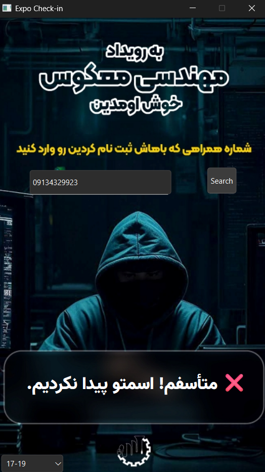
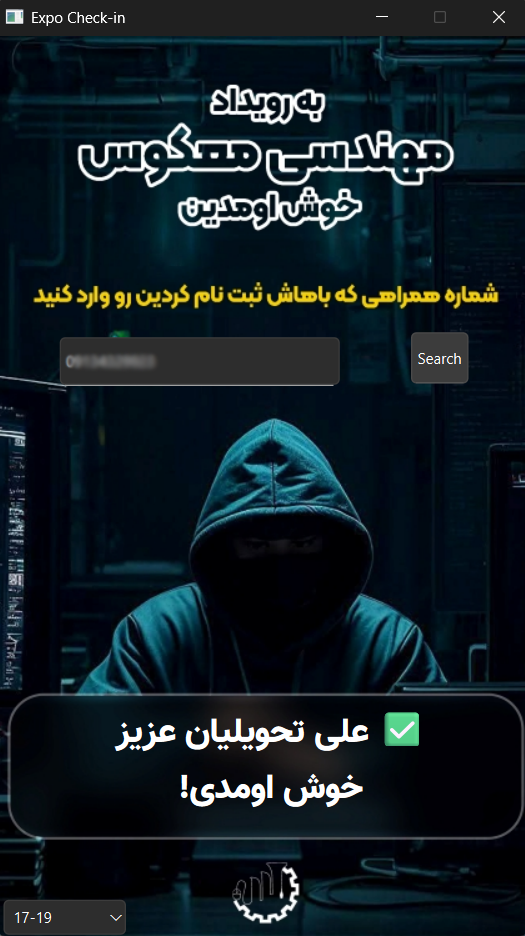

# ✅ Expo Check-in App (Persian)

A lightweight desktop application for checking attendee presence using mobile phone numbers and Excel files — built with PySide6 (Qt for Python).

  
  

---

## 📌 What is this?

This is a custom-designed, Persian-language check-in system made for expo events, conferences, or timed gatherings. Organizers can:

- Switch between different time slots.
- Input a visitor's mobile phone number.
- Automatically verify their presence using Excel files.
- Play welcoming or error sounds.
- Show a friendly greeting in Persian.

---

## 🛠️ How it works

1. **Excel files** (`15.17.xlsx`, `17.19.xlsx`) contain attendee names and phone numbers.
2. You choose a time slot (e.g., 15-17 or 17-19) from the dropdown.
3. You type in the attendee's phone number (without leading zero).
4. If the number exists, the name is displayed with a greeting, and a welcome sound is played.
5. If not found, a “not found” message and error sound are triggered.

---

## 🎯 Features

- 🔄 Time slot switcher (combobox).
- 🎵 Sound effects for welcome and error.
- 🎨 Beautiful Persian font and background.
- ⌨️ Keyboard-friendly (just type and press Enter).
- 🧾 Excel-based backend — easy to edit and manage.

---

## 💡 How to run

1. Clone the repository or download the ZIP.
2. Install dependencies:
